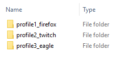
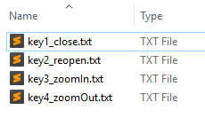
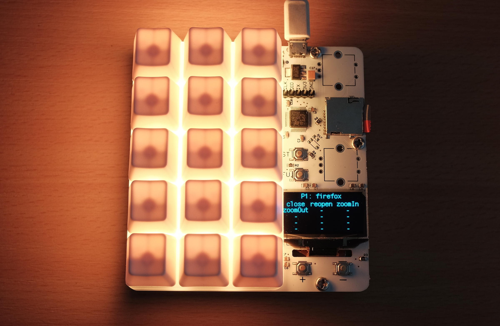

# kbord: Programmable Mechanical Keypad with RGB Backlight


kbord is a programmable keypad with 15 mechanical keys, each of which can be set to execute a script when pressed.

The script can be as simple as shortcut keys like ctrl+c, or as complex as one that creates root backdoors or grabbing passwords.

Multiple profiles are supported, for different programs/environments.

## Features

* 15 mechanical switches
* Individually addressable RGB backlights with animations
* OLED screen displaying current profile and key functions
* SD card script storage
* Standard duckyscript parsed onboard
* Multiple profiles supported

## Usage

### Step 1: Preparing profiles

Profiles are created as folders, with naming conventions like `profile#_name`, where `#` is the profile number, and `name` being the name of the profile. Here are some examples:



### Step 2: Preparing scripts

Now you're ready to write some scripts inside the profile folders. The script used in this project is Duckyscript, [click here to read its usage](https://github.com/hak5darren/USB-Rubber-Ducky/wiki/Duckyscript).

Each key has its own script file, named like `key#_name.txt`, where `#` is the key number(top left is 1, bottom right is 15), and `name` is a short description of what that key does. 

Here are some examples:



The screen will only display the first 7 characters of the key name, so keep it short!

### Step 3: (OPTIONAL) Set backlight color

This step is optional, but who would want to pass that? It's RGB after all.

Just create file named `config.txt` and set its content like this 
```
BG_COLOR 255 100 0
KEYDOWN_COLOR 100 0 255
```
BG_COLOR is the background color, the following numbers are value of the color that you can change, between 0 and 255, in the order of R-G-B.

Similarly, KEYDOWN_COLOR is the color for the key to change to when you press it down.

The content of the profile folder should now look like this:


If you skip this step the default backlight color would be light blue.

### Step 4: Run it!

Format a SD card in FAT32, put all the profile folders in the root of the SD card, and insert it in the SD slot.

kbord should start up with the first profile, displaying the profile names and key names, as well as the background color:



Press the corresponding keys to execute their scripts, if there is an error it will show up on the screen.

Press + - button on the lower right to change profiles.

### More examples!

[See here](sample_SD_card) for some profiles that has been already set up. You can start from there and make changes to suit your need.

## Making one yourself

Here are some notes for the one who want to make:

* Under construction...